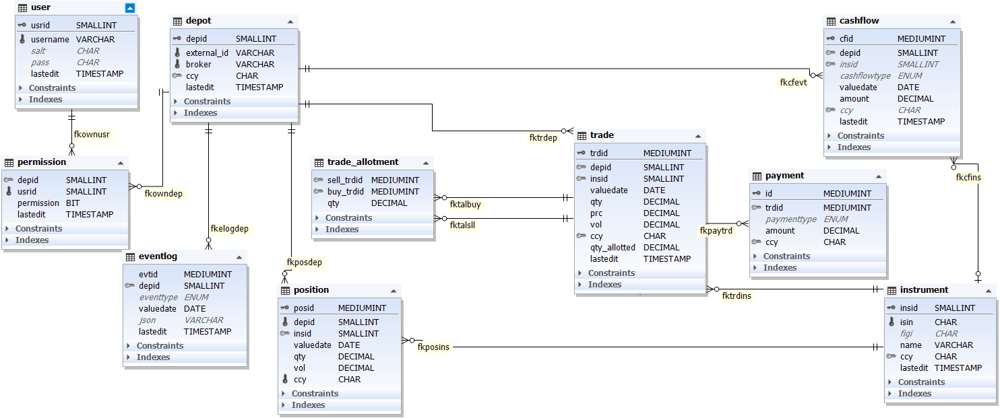

depotools for R
================

`depotools` is the `MariaDB` database backend for an R based trading /
investment tracking tool which comprises the packages

  - [iexcloudr](https://github.com/kermit-t-frog/iexcloudr) for querying
    new market data,
  - [depotr](https://github.com/kermit-t-frog/depotr) for working with
    *this* database.

## Basics

The database is meant to offer a lightweight access to storing and
retrieving your past trade data across multiple users with some level of
authentication (not *everybody* should be allowed to see my portfolio)
and to play around with strategies using some market data that’s
available in the database. For the time being, there are some 200+
instruments sourced from German XETRA, mostly. [Data provided by IEX
Cloud](https://iexcloud.io).

Trade database layout: 

## … wip from here on…
